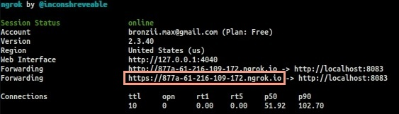
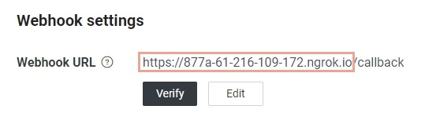

# EverBook
LINE bot 家庭記帳本


### 本機啟動服務：
#### 創建LINE bot Channel
[](https://developers.line.biz/en/)

到 LINE Developers 創建一個 Channel，產生出 Channel secret 及 Channel access token，並帶入啟動腳本對應的兩個參數當中
```bash
cd ever-book
sh DeployService.sh [CHANNEL_SECRET] [CHANNEL_TOKEN]
```
#### Webhook
- 使用ngrok開啟一個對外doamin(專案預設的port為8083):
```bash
ngrok http 8083
```


- 將 domain 綁定至 LINE bot Channel 完成 Webhook:



### Deploy to Fly.io：
<a href="https://fly.io/docs/app-guides/run-a-global-image-service/">
  
</a>

------------

### 功能：
- 記帳 (日期、金額、項目、付款方式、備註)
- 查看過去三個月每月記帳統計及細項
- 刪除紀錄
- 家庭帳本
  - 邦定成員
  - 查看綁定成員過去三個月記帳本